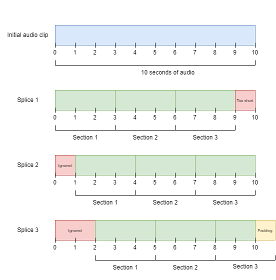

# DoSE Senior Design 2025 Acoustic Model

This repository holds the code used to create the acoustic model used within the DoSE Senior Design 2025 app. There are 3 different programs within this repository, each in their own folder. Each folder also has a README file which details how to use the code in each folder. Folder breakdown:

1. `display_spectrogram`: This code is only used for demonstration purposes and is not involved in training a model. This code creates and displays a Mel spectrogram for a given audio clip. Instructions for setting up and running the code can be found within the README in this folder (`display_spectrogram/README.md`).
2. `data_conversion`: This code is responsible for preparing dataset(s) for training. It trims all audio clips to 3 seconds in length and converts all audio clips into Mel spectrograms. Once finished, the provided dataset(s) will be saved into a folder named `train_data` as numpy array data. YOU WILL HAVE TO MAKE CHANGES TO THIS CODE FOR IT TO RUN. More detailed instructions for preparing dataset(s) can be found within its README (`data_conversion/README.md`).
3. `model`: This code trains a new CNN on Mel spectrograms of audio clips. You MUST preprocess your datasets using the `data_conversion` code. After training, the model is saved to a `model_results` folder. Training can take a long time depending on the size of the datasets used. 

## Installation

1. Ensure you have Python installed, Python version 3.12.5 was used when creating this code.
    - You can run `python --version` or `python3 --version` in the terminal to check if you have Python installed and its version.
2. Download or clone the project.
3. Open a new terminal and navigate to the projects directory. Make sure the project is unzipped.
3. Install the project's dependencies by running `python -m pip install -r requirements.txt`.
    - This may not work if your Python version does not match, Python 3.12.5 was used when creating this repository.
4. You should now be able to follow the README.md files within each folder for instructions on running the code. `data_conversion` prepares dataset(s) for the model, located in `model`. Some code may need alterations to run.

## Results

- For the DoSE App model, the [ASVP-ESD](https://www.kaggle.com/datasets/dejolilandry/asvpesdspeech-nonspeech-emotional-utterances) and [ESD](https://www.kaggle.com/datasets/nguyenthanhlim/emotional-speech-dataset-esd) datasets were used. 5 emotions were selected for detection (angry, happy, neutral, sad, and surprised).
- Using these datasets, nearly 140,000 Mel spectrograms are created for the model to train on. This is achieved by splicing longer audio clips in the dataset. For example, if an audio clip is 10 seconds in length:

Using this technique, the 10 second audio clip has 9 usable 3 second clips. 
- Using this data, this CNN achieved an overall accuracy of 84% on 5 emotions (angry, happy, neutral, sad, and surprised).

## References 

Kun Zhou, Berrak Sisman, Rui Liu and Haizhou Li, "Seen and unseen emotional style transfer for voice conversion with a new emotional speech dataset" ICASSP 2021-2021 IEEE International Conference on Acoustics, Speech and Signal Processing (ICASSP) 

Dejoli, T. T. L., He, Q., & Xie, W. (2021). Audio, Speech and Vision Processing Lab Emotional Sound database (ASVP-ESD). Zenodo (CERN European Organization for Nuclear Research). https://doi.org/10.5281/zenodo.4782712

## Honorable Mention

This Github was very helpful in learning how to set up the code and model: https://github.com/krbo8o5/emotion_detection/tree/main
